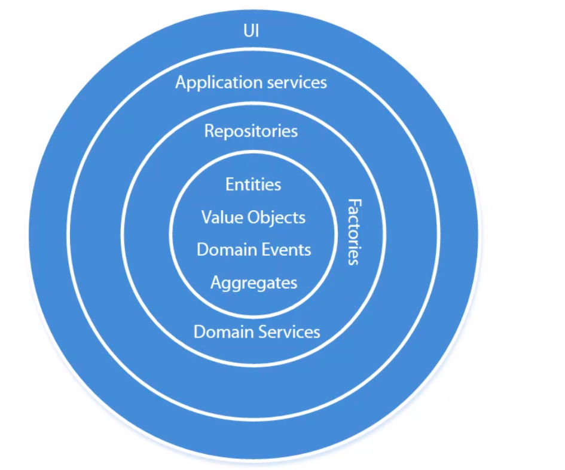

## ResponsibleEntity

Dans notre domaine des UEs, ResponsibleEntity (et son validateur) ne respectent pas nos guidelines vues précédemment
 en workshop.

- Quelle(s) guideline(s) et/ou quel(s) principe(s) ResponsibleEntity ne respecte-il pas ? 
- Comment pourrait-on améliorer notre code ?


<br/><br/><br/><br/><br/><br/><br/><br/>


## BusinessValidator : frozen=True ? Quid des propriétés calculées ?

- Si une propriété ne doit être calculée qu'une seule fois : sandwich pattern.
    - À calculer au départ de la fonction "validate" **dans le domaine**
    - Propriété (variable) à passer en paramètre de chaque sous fonction, qui seront "statiques"
        - Car ne modifie pas l'état de l'objet

```python

@attr.s(frozen=True, slots=True)
class ComplexBusinessValidator(BusinessValidator):

    root_entity = attr.ib(type=RootEntity)
    attr2 = attr.ib(type=PrimitiveType)
    attr3 = attr.ib(type=PrimitiveType)
    attr4 = attr.ib(type=PrimitiveType)

    def validate(self, *args, **kwargs):
        complex_result = self.root_entity._complex_computation()
        other_result = self.some_computation(complex_result)
        another_result = self.some_other_computation(complex_result)
        # if ... raise ...
        
    @staticmethod
    def some_computation(complex_result):
        pass
            
    @staticmethod
    def some_other_computation(complex_result):
        pass    

```


<br/><br/><br/><br/><br/><br/><br/><br/>


## DTO : Data Transfer Object


### Définition

- "Objet de transfert de données"
- Patron de conception d'architecture
- Objectif : simplifier le transfert des données entre les couches d'une application logicielle 
- Possède uniquement des déclarations d'attributs
- Aucune logique technique, métier, fonction...
- "Contrat de données" qui nous aide à atteindre la compatibilité entre les différentes couches d'une application
- Enlève l'interdépendance entre couches
    - Facilite le refactoring


#### :question: Avons-nous déjà des DTO dans notre code actuel ?


<br/><br/><br/><br/><br/><br/><br/><br/>


### Problème

- En tant qu'utilisateur, je veux rechercher toutes les formations et versions de formations sur base d'un formulaire de recherche :
    - année académique
    - Sigle (intitulé abrégé) (toutes versions confondues)
    - code
    - intitulé
    - type
    - entité
- Dans la vue "liste", je veux afficher 
    - année académique
    - Sigle (intitulé abrégé)
    - intitulé
    - type
    - entité de charge
        - acronym
        - intitulé (en helptext)
    
```python
# Application service
def search_program_trees_versions_service(cmd: interface.CommandRequest) -> List['ProgramTreeVersion']:
    return ProgramTreeVersionRepository().search(**cmd)
```

<br/><br/><br/><br/>

Constats : 
- Recherche lente (performance)
    - Renvoie ProgramTreeVersion objet complet du domaine avec toutes entities imbriquées (ProgramTree, etc)
- Charge beaucoup de données inutiles
    - Peu de champs de l'objet du domaine sont utiles


<br/><br/><br/><br/><br/><br/><br/><br/>


### Solution


```python

# ddd/dtos.py
class SearchProgramTreeVersionDTO(interface.DTO):
    academic_year = attr.ib(type=int)
    acronym_abbreviated_title = attr.ib(type=str)
    title = attr.ib(type=str)
    type = attr.ib(type=str)
    entity_acronym = attr.ib(type=str)
    entity_title = attr.ib(type=str)
    code = attr.ib(type=str)

#--------------------------------------------------------------------------------------------------------
# ddd/repository/program_tree_version.py

class ProgramTreeVersionRepository(interface.AbstractRepository):

    def search(self, **searchparams) -> List[SearchProgramTreeVersionDTO]:
        # To implement
        return []

    def search_program_trees_versions(self, **searchparams) -> List[ProgramTreeVersion]:
        # To implement
        return []

```

Avantages :
- Découplage de la DB (et des querysets)
    - Contrat de données attendues pour la recherche d'une liste de versions de programmes
- Performances


Inconvénients :
- Mapping supplémentaire entre notre DB et un objet "de vue" (notre DTO)
    - Maintenance supplémentaire


```python

class ProgramTreeVersionRepository(interface.AbstractRepository):

    def search(self, **searchparams) -> List[SearchProgramTreeVersionDTO]:
        # To implement
        return []

    def search_program_trees_versions(self, **searchparams) -> List[ProgramTreeVersion]:
        # To implement
        return []

    def search_for_trainings_only(self, **searchparams) -> List[SearchForTrainingsOnlyDTO]:
        """
        Uniquement si les données affichées dans la vue liste sont différentes de SearchProgramTreeVersionDTO.
        Sinon, on réutilise search().
        """
        # To implement
        return []

    def search_for_transitions_only(self, **searchparams) -> List[SearchForTransitionsOnlyDTO]:
        """
        Uniquement si les données affichées dans la vue liste sont différentes de SearchProgramTreeVersionDTO.
        Sinon, on réutilise search().
        """
        # To implement
        return []

```


<br/><br/><br/><br/><br/><br/><br/><br/>


## Quand utiliser un DTO ?

- Dans le `Repository`, tout ce qui vient d'un `Queryset` Django, car :
    - Utilise les Factory (autre couche) pour créer un objet du domaine
    - Permet de typer les valeurs de retour des querysets

- En cas de problème de performance en lecture
    - Cas possibles : 
        - Vue de recherche (vue liste)
        - données initiales de Forms filtrées : DTO ou domain service ? (exemple : filtrer les etds en états X ou Y)
        - Fichier Excel
        - Fichier PDF
    - Dans ce cas, les Views/forms/pdf/excel... réutilisent un ApplicationService qui renvoie un DTO à partir d'un Repository

- En cas d'inexistence du domaine métier (développement d'écrans en lecture seule)

- Données initiales de nos formulaires (ChoiceField, django-autocomplete-light) - à la place des querysets
    - ApplicationService (lecture) qui renvoie un DTO à partir d'un Repository
    - **Attention : pas de logique métier dans Queryset !**
        - Exemple : afficher les campus de l'organisation UCL uniquement
            - CampusRepository.search(...)
            - SearchUCLCampusOnlyDomainService qui filtre en mémoire le résultat de CampusRepository.search(...) 


<br/><br/><br/><br/><br/><br/><br/><br/>


## Interface : définition

- Déclaration d'un ensemble standardisé de méthode
- Intermédiaire entre 2 logiciels au travers d'un langage commun
- Objectif : cacher la difficulté d'accès à un logiciel
- Plus notre logiciel est modulaire/découplé, plus il y aura d'interfaces 
- Exemple :
    - API : Application Programming Interface
        - Protocole de communication : HTTP / HTTPS


#### :question: Avons-nous d'autres interfaces dans notre code ?


<br/><br/><br/><br/><br/><br/><br/><br/>


## Bounded Context

- "Partie définie du logiciel dans laquelle des termes, définitions et règles particulières s'appliquent de manière cohérente"

- Cf. https://martinfowler.com/bliki/BoundedContext.html

- Dans Osis, l'UE a-t-elle une définition exactement la même dans les contextes suivants ?
    - "UE" dans le catalogue de formation
    - "UE" dans parcours
    - "UE" dans attribution

- Exemples de bounded contexts :
    - Catalogue de formations
    - Parcours
    - Inscription centrale
    - Admission d'un étudiant

- Bounded context = design from scratch


<br/><br/><br/><br/><br/><br/><br/><br/>


## Et pour les éléments de même définition à travers les bounded contexts ?

### Shared Kernel

- Regroupe les objets réutilisables à travers les bounded contexts
    - Souvent des ValueObjects

- Exemples :
    - IbanAccount
    - Language
    - Country
    - ...

- Attention : un shared kernel est difficile à faire évoluer car utilisé dans TOUS les bounded contexts 


<br/><br/><br/><br/><br/><br/><br/><br/>


## Architecture en oignon

### Schéma et couches



### Arborescence des packages

```
Osis (racine projet git)
 ├─ ddd
 |   ├─ logic (aucun import externe comme Django, etc.)
 |       ├─ bounded_context_1
 |       |   |
 |       |   ├─ builder (factory)
 |       |   |   ├─ <root_entity>_builder.py  (Builder pour RootEntity)
 |       |   |   ├─ <root_entity_entity>_builder.py  (Builder pour EntityIdentity)
 |       |   |
 |       |   ├─ domain
 |       |   |   ├─ model
 |       |   |   |   ├─ <root_entity>.py  (RootEntity)
 |       |   |   |   ├─ _entity.py (protected)
 |       |   |   |   ├─ _value_object.py (protected)
 |       |   |   |
 |       |   |   ├─ service (Domain Service)
 |       |   |   |   ├─ <domain_service_name>.py
 |       |   |   |
 |       |   |   ├─ validator
 |       |   |       ├─ _should_<business_validator_rule>.py
 |       |   |       ├─ exceptions.py
 |       |   |       ├─ validator_by_business_action.py
 |       |   |
 |       |   ├─ repository (uniquement interfaces !)
 |       |   |   ├─ i_<root_entity>.py
 |       |   |
 |       |   ├─ test
 |       |   |   ├─ ...
 |       |   |
 |       |   ├─ use_case (Application Service)
 |       |   |   ├─ read
 |       |   |   |   ├─ <action_métier>_service.py
 |       |   |   |
 |       |   |   ├─ write
 |       |   |       ├─ <action_métier>_service.py
 |       |   |
 |       |   ├─ commands.py
 |       |   |
 |       |   ├─ dtos.py
 |       |   |
 |       |   ├─ events.py
 |       |
 |       ├─ bounded_context_2
 |       |
 |       ├─ bounded_context_3
 |       |
 |       ├─ shared_kernel
 |   
 ├─ infrastructure
 |   ├─ bounded_context_1
 |   |   ├─ repository (implémentation des interfaces)
 |   |       ├─ <objet_métier>.py
 |   |
 |   ├─ bounded_context_2
 |   |
 |   ├─ bounded_context_3
 |   |
 |   ├─ message_bus.py
 |
 ├─ django_app_1
 |
 ├─ django_app_2

```


<br/><br/><br/><br/><br/><br/><br/><br/>


## Message bus


### Commands : rappel

- Représente les actions possibles d'un utilisateur
    - Fait partie entièrement du domaine
- Déclenche une modification dans notre domaine
- Une commande peut ne pas être "valide" pour notre domaine (cf. validateurs) 
    - Les paramètres d'une commande ne peuvent jamais être considérés comme une valeur "valide"
    - Le domaine ne peut pas s'y fier et doit valider les paramètres d'entrée
    - Interdit de passer des valeurs calculées "businessement" dans une commande
- "Appels de méthode sérialisables"
- Exemple :
```python

@attr.s(frozen=True, slots=True)
class CreateOrphanGroupCommand(interface.CommandRequest):
    code = attr.ib(type=str)
    year = attr.ib(type=int)
    type = attr.ib(type=str)
    abbreviated_title = attr.ib(type=str)
    title_fr = attr.ib(type=str)
    title_en = attr.ib(type=str)
    credits = attr.ib(type=int)
    constraint_type = attr.ib(type=str)
    min_constraint = attr.ib(type=int)
    max_constraint = attr.ib(type=int)
    management_entity_acronym = attr.ib(type=str)
    teaching_campus_name = attr.ib(type=str)
    organization_name = attr.ib(type=str)
    remark_fr = attr.ib(type=str)
    remark_en = attr.ib(type=str)
    start_year = attr.ib(type=int)
    end_year = attr.ib(type=Optional[int])
```

- Application service == command handlers (gestionnaire de commandes)

- Lorsqu'on cherche un use case (application service), on doit chercher sa commande correspondante
    - redondance
    - 1 commande == une action métier == 1 application service


<br/><br/><br/><br/><br/><br/><br/><br/>


### Message bus : Définition et objectifs


- Activer les actions correspondantes aux commandes
- Gérer les événements associés
- Structure préparée à la gestion des événements


#### Message bus : Implémentation


```python

class MessageBus:
    command_handlers = {
        command.CreateOrphanGroupCommand: lambda cmd: create_group_service.create_orphan_group(cmd, GroupRepository())
    }


#-------------------------------------------------------------------------------------------------------------------
# Django Form
class UpdateTrainingForm(ValidationRuleMixin, DisplayExceptionsByFieldNameMixin, forms.Form):
    code = UpperCaseCharField(label=_("Code"))
    min_constraint = forms.IntegerField(label=_("minimum constraint").capitalize())
    max_constraint = forms.IntegerField(label=_("maximum constraint").capitalize())

    field_name_by_exception = {
        CodeAlreadyExistException: ('code',),
        ContentConstraintMinimumMaximumMissing: ('min_constraint', 'max_constraint'),
        ContentConstraintMaximumShouldBeGreaterOrEqualsThanMinimum: ('min_constraint', 'max_constraint'),
        ContentConstraintMinimumInvalid: ('min_constraint',),
        ContentConstraintMaximumInvalid: ('max_constraint',),
    }
    
    # def call_application_service(self):
    #     command = ...
    #     return update_training_service(command)

    def get_command(self) -> CommandRequest:
        return CommandRequest(**self.validated_data)

```

- Implique
    - Injection des `Repository` dans les application services
    - Une action métier (commande) correspond à un application service (exécution de l'action)
        - 2 commandes == 2 actions métier différentes
            - Pas d'héritage de commande
            - Pas de réutilisation d'1 command dans 2 Application services

- Avantages
    - Views django : plus d'import d'application service, uniquement de commands
    - Tests unitaires facilités : injection `repository` en fonction de l'environnement
        - InMemoryRepository
        - PostgresRepository
        - ...


<br/><br/><br/><br/><br/><br/><br/><br/>


# Conclusion

## Rappel : problèmes constatés (mars 2020)

- Osis est rigide
    - difficile à faire évoluer car un changement ciblé peut affecter une autre partie du système
- Osis est fragile
    - lorsqu‘on fait un changement, cela amène des régressions non prévisibles sur le système
- Osis est immobile
    - difficile à réutiliser dans une autre application (difficile de dissocier une partie métier)

- Difficulté d'être "agile" techniquement


<br/><br/><br/><br/><br/><br/><br/><br/>


## Solution

- Langage commun et universel à travers tous les intervenant du projet
    - analystes <-> experts métier <-> développeurs ...
    - devs <-> devs
        - guidelines : langage commun
- Découplage complet
    - Technique
        - Outils : Django, Postgres...
        - Affichage des données
        - Stockage des données
        - Domaine métier
        - Validations métier
        - ...
     - Logique métier

- Couches structurées à responsabilités définies et limitées
    - Architecture en "oignon"
    - DDD
        - Domaine Pure et incomplet
        - DomainService, ApplicationService
    - Design patterns (Factory, Builder...)
    - DTO
    - CQRS
        - Commandes
        - CommandBus
    - ...
